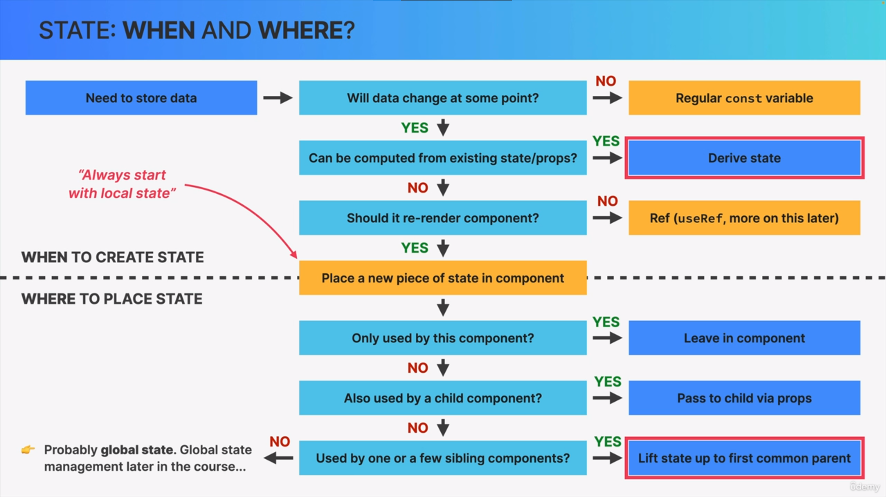
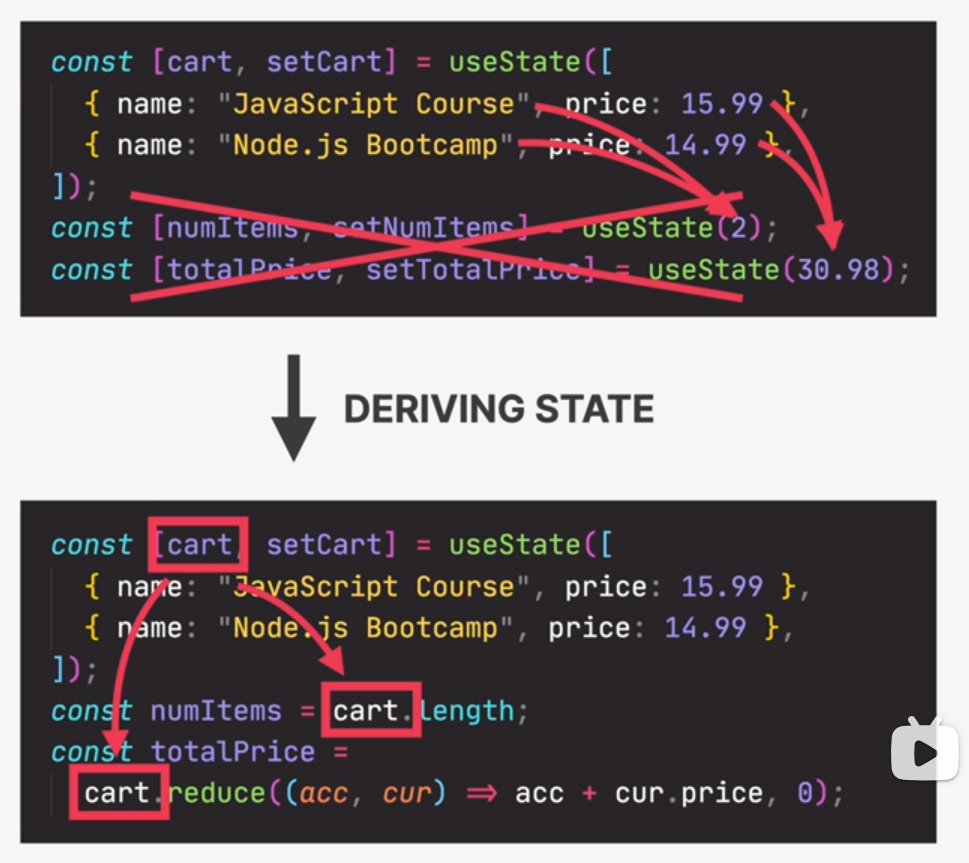

# React Notebook✅

## State Management

#### When to create state❓

#### What type of it are necessary❓

#### Where to place them ❓

### Global State VS. Local State 🤔

|        LOCAL STATE         |            GLOBAL STATE             |
| :------------------------: | :---------------------------------: |
| one or few components uzit |        many components uzit         |
|  defined inside component  | shared for all component in the app |

#### Inverse Data Flow 🤔

In react,the data flow direction is always **_one-way_**⬇  
which means the data will not be passed from children  
**components** to parent **components**.
The "Lifting Up State" can solove that scene.  
**_Move the state to parent component and pass the [state,setState]  
as props._**

#### State Derived 🤔

Sometime we don't have to create State variable  
just simplily derive state from exsit state.

**_Example_**✅: we derive num state & totalPrice state  
from cart state
  
**Every single we update state cause the component re-render.💔**

## Children Props 🤔

children Props can make our components  
be re-usable.
Imagine that you want to show some different  
description on **_Button Components_**,and  
now you can pass **component** as a prop to Component you want to render,this **component** will be received by reserve variable 'children'.
For Example😀:

## Component Categories Logically 🤔

#### Stateless Components

No State.  
Can receive props and simplly present receive data or content.  
Usually small and reusable.

#### Stateful Components

Have state.  
Can still be reusable.

#### Sructureal Components

"Pages","layouts"......  
Result of composition.
Can be Huge and non-reusable

#### Props Drilling 🤔

Sometimes,the component nested so much  
In order to pass Prop to the Target Component  
we must keep passing the props over and  
over again which is noisying.😫

#### How to fix Props Drilling 😀

The Answer is **_Children Props_**

# How actually things work intenally inside React✅

#### Components && Instances && Elements

##### Summary 😋

Actually,React does not directly manipulate  
**_DOM_**,but it will create some **_elements_** by  
calling React Functions. And this kind of elements are bascially comprise with some  
instances of **_ReactComponent_** which is function  
we defined in component related file,those  
components will return **_JSX_** when we use it.

### Tip: Component != JSX but invole it

Components encapsulate the behavior and  
structure of UI.They can be function or classes that return **_JSX_**,defining how the **_UI_** looks like based on the component's logic and props.

## ------------------------------------

### Componrnt(Instances) Lifecycle🤔

Before we learn about the hook **_useEffect_**  
section **which** we should konw something  
about lifecycle of a component.

### How Rendering Work🤔

#### OverView

### Rendering Phase ✅

##### The Mechanics Of State In React

##### Virtual Dom

##### Recociliation By Recociler:Fiber

### Commit Phase ✅

### Summary Process Of Rendering

### Effects And Data Fetching ✅
